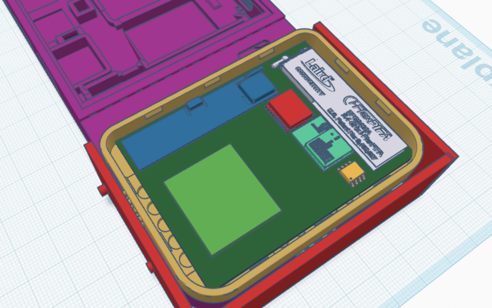
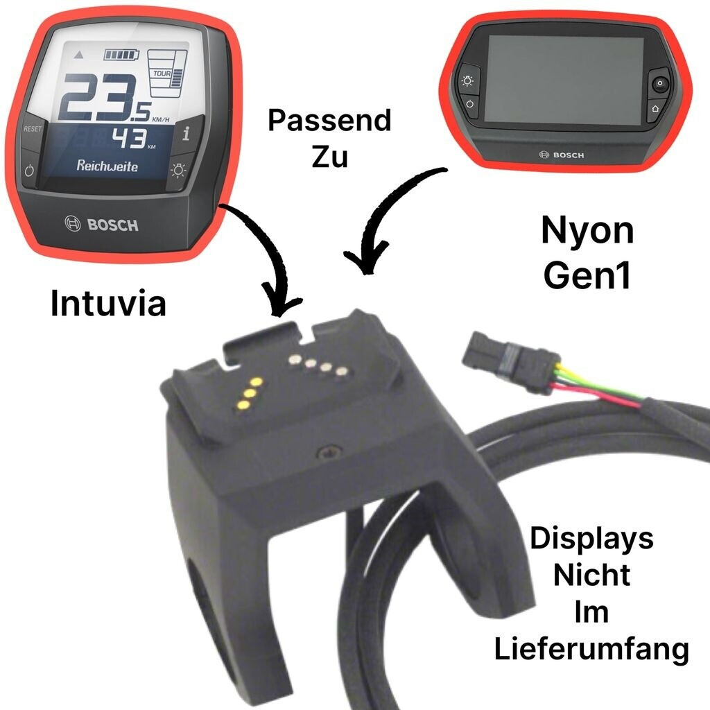

# comet-Navigator
Extension for the [Mecha Comet](https://mecha.so/comet) based on the nRF54H20 with GPS, IMU and CAN

Part of the [PedalPirat](https://github.com/PedalPirat/PedalPirat) ecosystem, intended to be used with the [pizero_bikecomputer](https://github.com/hishizuka/pizero_bikecomputer)

## Motivation
I want to use the pizero_bikecomputer on a Mecha Comet. For it to work it needs some sensors as described [here](https://github.com/hishizuka/pizero_bikecomputer/blob/master/doc/hardware_installation.md), so the goal is to create a PCB with
- Nordic [nRF54H20](https://www.nordicsemi.com/Products/nRF54H20)
  - Supports ANT+ (soon)
  - CAN
  - USB Host to connect to the Comet
- u-blox [MAX-M10S](https://www.u-blox.com/en/product/max-m10-series) (GPS)
- Bosch [BHI385](https://www.bosch-sensortec.com/products/smart-sensor-systems/bhi385/) (IMU/Environmental)
- CAN-Transceiver (to connect to the PedalPirat or E-Bikes)
- 5 Buttons (to control the Software)
- USB Hub (?) to connect AI-Cameras
- Power Delivery to charge the Comet
- GPIO/I2C/SPI Breakout

## Design Idea
### PCB
The core will be a nRF54H20 MCU by Nordic to which the other Components get connected to.

There also needs to be a connector for the GPS antenna or an onboard antenna.

- Green1 = BHI385
- Blue = GPS Antenna
- Red = uBlox MAX-10S
- Green2 = Ezurio BL54H20 (nRF54H20)
- Yellow = CAN Transceiver
- White = BT/ANT+ Antenna

### Firmware
The firmware will be written for the Nordic [nRF Connect SDK](https://docs.nordicsemi.com/bundle/ncs-2.5.2/page/nrf/index.html) which is based on the [Zephyr RTOS](https://github.com/zephyrproject-rtos/zephyr).

The data of the sensors is accessed by the Comet via USB.

### Mounting
#### Comet Extension
Extension that mounts on the Extension Interface of the Comet and screws to it's side to ensure it doesn't move.

[Comet Pin-Out Docs](https://developers.mecha.so/comet/working-with-io/pin-diagram)
#### Mount/Dock
Dock for the Comet that includes an USB-Hub to connect Cameras etc, connects CAN and Power.

Maybe something like the Bosch Intuvia Dock 

## Existing Products / Designs
- [Comet Gamepad V1](https://github.com/PedalPirat/comet-Navigator/tree/main/resources/mecha/Comet-Gamepad-V1)
- [SparkFun MAX-M10S](https://github.com/sparkfun/SparkFun_u-blox_MAX-M10S)
- [Bosch BHI385 Shuttle board](https://www.bosch-sensortec.com/media/boschsensortec/downloads/shuttle_board_flyer/application_board_3_1/bst-bhi385-sf000-00.pdf)
